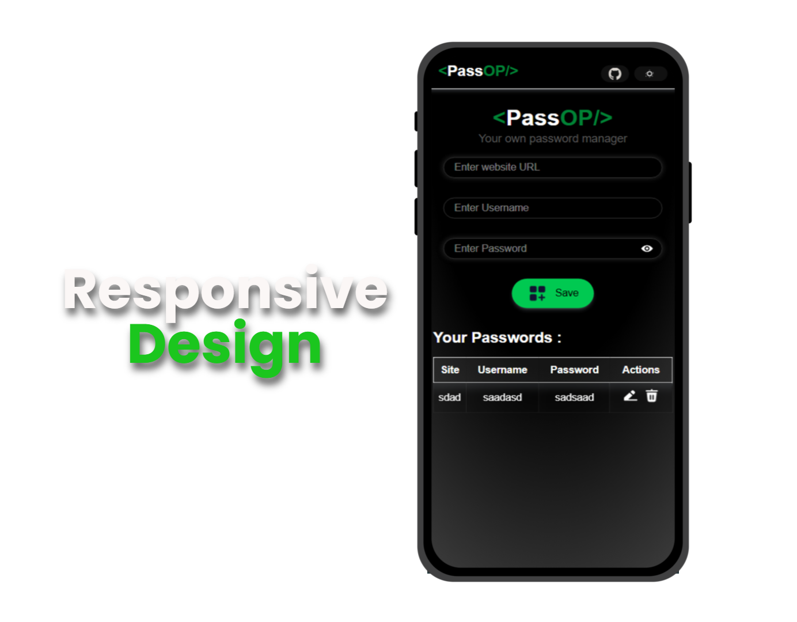
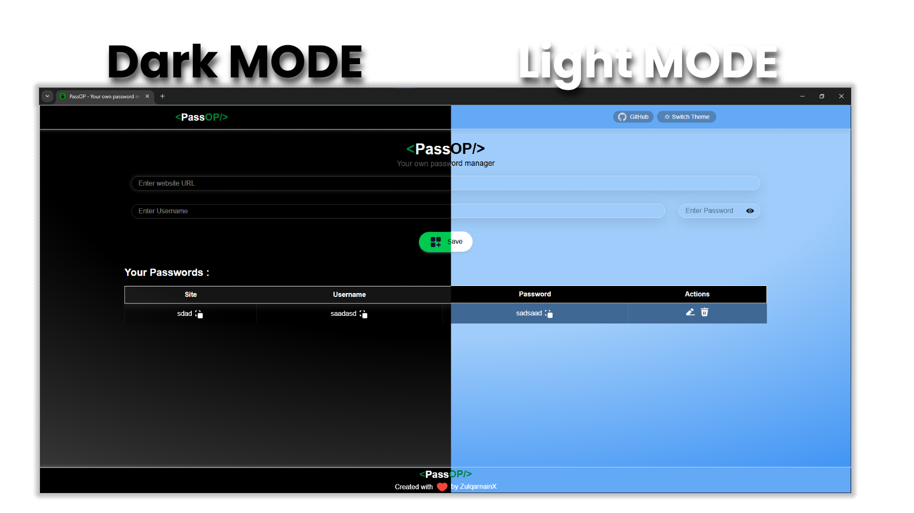

# Password Manager

A simple, secure, and fully responsive **Password Manager** built with **Vite**, **React**, and **Tailwind CSS**. 

Store, edit, delete, and copy your passwords easily with a clean UI that supports both **dark** and **light** modes. All passwords are saved securely in **localStorage** for quick access without any backend.



## Features

- Add new passwords with ease
- Edit existing password entries
- Delete passwords you no longer need
- Copy passwords to clipboard with one click
- Persistent storage using **localStorage**
- Supports **Dark Mode** and **Light Mode** toggling  
- Responsive design optimized for all screen sizes  
- Notifications for actions using **React Toastify**



## Technologies Used

- **Vite** — Lightning fast build tool  
- **React** — UI library for building user interfaces  
- **Tailwind CSS** — Utility-first CSS framework for styling  
- **React Toastify** — For elegant toast notifications  
- **localStorage** — Browser storage for saving passwords locally  

#
* Use the **Add Password** form to store your credentials.
* Click **Edit** to modify any saved password.
* Use **Delete** to remove entries.
* Click **Copy** to copy passwords to your clipboard.
* Toggle between **Dark** and **Light** modes with the switch.

## Folder Structure

```
/Preview
  ├── Responsive_Design.png
  └── dark_light_preview.png
/src
  ├── components
  ├── pages
  └── styles
```

## Screenshots

### Responsive Design


### Dark and Light Mode Preview


Feel free to contribute or suggest improvements!
